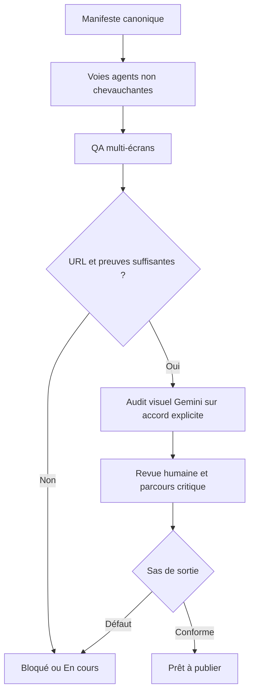

# Pipeline de sortie du portefeuille — 23 septembre 2026

Ce dossier coordonne les audits sans modifier les produits, publier, déployer
ou appeler une API payante par défaut. Il complète `qa-release` au lieu de le
dupliquer et sait appeler l’adaptateur Gemini d’Audit Landing lorsqu’il est
présent (PR dédiée #1011).



## Répartition multi-agents

| Voie | Périmètre |
| --- | --- |
| `commerce` | Artisan Express V2, Annuaire IA |
| `audit` | Audit Landing |
| `mobile` | Look and Find |
| `studio-core` | Amorce |
| `sensitive` | Respire |
| `ensemble` | produits Ensemble, avec contrôle sécurité renforcé |
| `sites-rapides` | petits sites déjà déployés, contrôlés par lots |
| `creation` | Roussy & Zéphy, Éveil, Accord, Bio Résonante, Résonance |
| `studio-last` | Lefouzèbreizh Studio, toujours traité en dernier |

Chaque agent livre : URL/version, contrôles réellement exécutés, preuves,
défauts ouverts et prochaine action. La reprise centrale est seule habilitée
à attribuer le statut final.

## Commandes sûres

Valider ou lister, sans accès réseau :

```powershell
python portfolio-release/runner.py --validate
python portfolio-release/runner.py --list
python portfolio-release/runner.py --lane sites-rapides --output C:\temp\plan-sites
```

Lancer le sas QA (lecture des sites, captures et rapports ; aucun déploiement) :

```powershell
python portfolio-release/runner.py --project artisan-express-v2 --execute-qa --output C:\temp\qa-artisan
```

L’analyse Gemini requiert deux drapeaux afin qu’un appel susceptible de
consommer un quota ne parte jamais par accident :

```powershell
python portfolio-release/runner.py --project artisan-express-v2 --execute-gemini --accept-gemini-usage --gemini-env-file CHEMIN_SECRET --output C:\temp\audit-artisan
```

## Garde-fous

- Le mode par défaut produit seulement un plan.
- Le runner ne contient aucune commande de déploiement, publication ou fusion.
- Une URL absente bloque l’exécution du projet au lieu d’en inventer une.
- Gemini ne démarre qu’avec `--execute-gemini --accept-gemini-usage`.
- La clé reste dans l’environnement ou le fichier secret local ; elle n’est jamais copiée.
- L’adaptateur Gemini n’est pas recopié : la PR #1011 reste sa source de vérité.
- Un QA vert ne promeut jamais automatiquement le statut du projet.
- Les données personnelles, la jeunesse et le bien-être exigent une revue dédiée.

## Sorties

Chaque exécution crée un dossier inédit contenant `report.json` et `report.md`.
Les sorties de commandes sont bornées et conservées dans le JSON. Les captures
de `qa-release` et d’Audit Landing restent dans leurs dossiers de preuves.
`CONTROL.md` pilote le lot ; `BANK-SUMMARY.md` prépare les démonstrations des
rendez-vous sans présenter de revenu non prouvé.